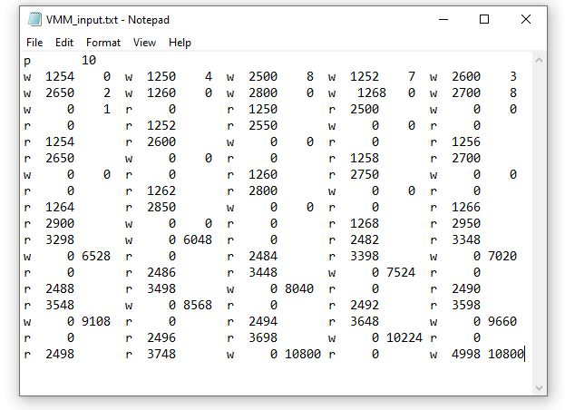
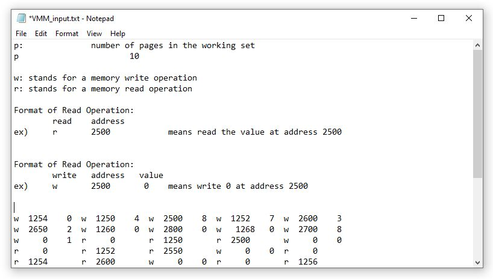
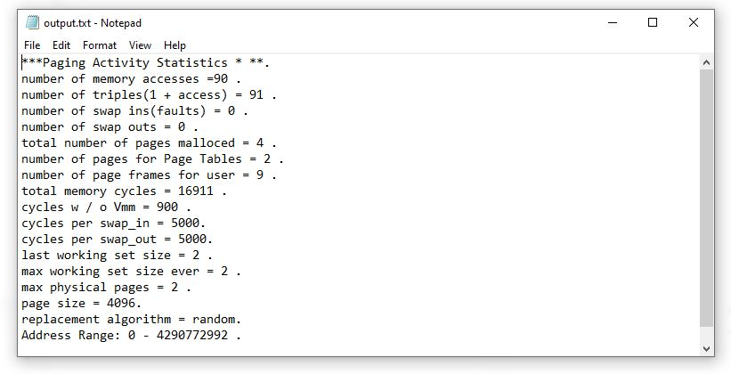
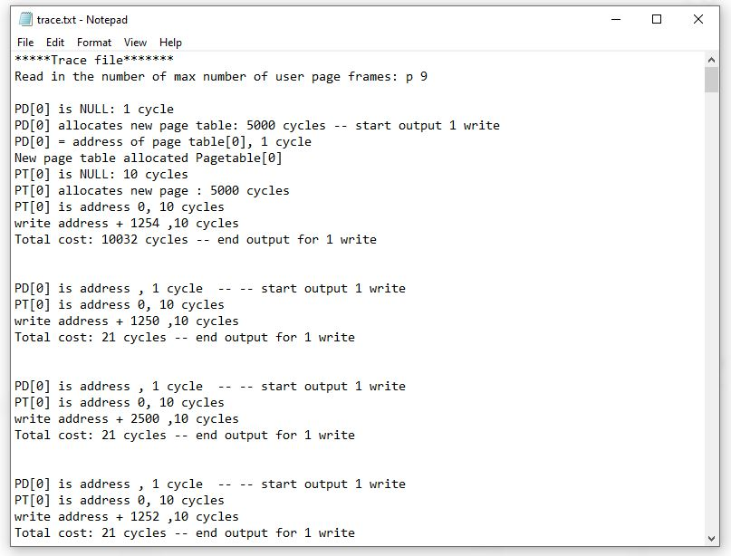

# VMM-simulator
A C++ project meant to simulate Virtual Memory management. It simulates page swapping, the working set, and all the operations that go into created and managing virtual memory in a computer.

## Directions:

### Create a sample input as Follows:
1. Run the address generator cpp file.
2. Address generator cpp will generate input.txt.
3. Run the VMM_Simulator_program with the input.txt file you previously generated. 
#### Sample Input File

##### Format of input file

The input file begins by declaring the number of pages to have in the working set. This is followed by many read and write memory operations. Read operations are specified by write 'r' followed by the address to be read. Write operations are specified by 'w' followed by the address to write to followed by the value to write to the address.

### Sample Output Files

#### Page Activity Statistics

#### Trace file
Showcases the individual actions taken by the program to do each virtual memory operation in detail.

